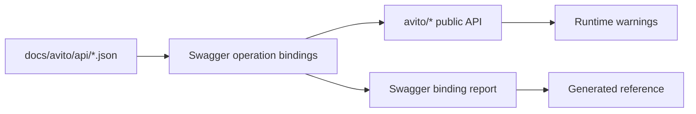

# Покрытие API и deprecation

Swagger/OpenAPI-файлы в `docs/avito/api/` считаются upstream source of truth. Строгие проверки сначала обновляют этот каталог из публичного Avito developer portal, затем строят Swagger binding report через binding discovery на публичных SDK-методах. Справочник reference строится из публичной поверхности SDK, а страницы покрытия и карты операций генерируются из этого report.

## Почему нужны оба источника

OpenAPI описывает upstream API. Reference описывает публичный SDK-контракт, с которым работает пользователь. Если операция есть в spec, но отсутствует в публичной поверхности SDK, пользователь не найдёт её в документации и не сможет вызвать через фасад.

## Deprecated metadata

Для deprecated-операций SDK хранит `deprecated_since`, `replacement` и `removal_version`. Эти поля нужны сразу в трёх местах: runtime `DeprecationWarning`, reference warning и changelog/release notes.

Deprecated-страница в reference не заменяет runtime warning. Если символ устарел, пользователь должен получить предупреждение при вызове, а не только при чтении сайта.

## Legacy policy

Operation-level `deprecated: true` в Swagger означает, что публичный SDK binding обязан иметь `deprecated=True` и `legacy=True`. Такой binding разрешён только для операции, которая действительно помечена deprecated в Swagger.

Для deprecated binding публичный метод SDK должен быть обёрнут через `deprecated_method(...)`, чтобы при вызове был runtime `DeprecationWarning` с `deprecated_since`, `replacement` и `removal_version`. `legacy=True` для non-deprecated операции запрещён без отдельного allowlist-исключения с причиной и датой удаления.

## Гейты

Публичная поверхность проверяется contract-тестами и сборкой reference-документации. `make swagger-coverage` скачивает свежие Swagger files, запускает strict binding validation и полный contract suite. Deprecated-символы должны сохранять runtime warning, а не только пометку в документации.

## CLI coverage

CLI coverage считается отдельно от SDK coverage, но строится из той же Swagger
binding discovery. Для первого CLI-релиза sync binding должен иметь ровно одну
canonical CLI-команду или documented intentional exclusion. Compatibility aliases
не считаются покрытием.

Нормальные API-команды идут через `AvitoClient` factory и публичный доменный
метод. Четыре token-client bindings без публичной factory намеренно исключены:
CLI не вызывает token clients напрямую, а пользовательскую готовность credentials
покрывают `account`, `status` и `doctor`.

`scripts/lint_cli_coverage.py --strict` проверяет one-to-one mapping, kebab-case
имена, alias policy, safety metadata, execution-smoke coverage и полноту
исключений. `make cli-lint` входит в `make check`.

Страница для пользователя: [покрытие API](../reference/coverage.md). Детальный отчёт: [отчёт покрытия API](../reference/api-report.md). Карта операций: [operations reference](../reference/operations.md).

Подробная механика discovery, strict lint, JSON report и `SwaggerFakeTransport` описана в [Swagger binding subsystem](swagger-binding-subsystem.md). CLI registry и coverage linter описаны в [архитектуре CLI](cli-architecture.md).
