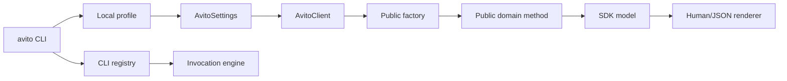

# Архитектура CLI

CLI в `avito-py` сделан как продуктовая оболочка над публичным SDK, а не как
второй SDK. Его задача — принять shell-аргументы, выбрать локальный профиль,
вызвать публичный `AvitoClient` и безопасно напечатать результат.



## Тонкая оболочка над SDK

API-команда не знает, как устроены HTTP-запросы, OAuth, retry, Swagger operation
specs, transport или mapper-слой. Для API-вызова она проходит один путь:

1. Разобрать root-флаги и аргументы команды.
2. Найти профиль и собрать `AvitoSettings`.
3. Создать `AvitoClient(settings)` в context manager.
4. Вызвать публичную factory, например `account()` или `ad(...)`.
5. Вызвать публичный доменный метод.
6. Сериализовать результат через публичный контракт модели.

Production-код в `avito/cli/` не импортирует transport implementations,
`OperationSpec`, `OperationExecutor`, auth provider internals, `tests` или fake
transport. Это проверяется architecture lint.

## Registry и discovery

Канонические API-команды строятся из Swagger binding discovery:

- `factory` задаёт CLI resource;
- `method_name` задаёт CLI action;
- `factory_args` и `method_args` задают поддержанные флаги;
- публичные type hints используются только для проверки и приведения значений;
- `timeout` и `retry` не становятся флагами конкретного метода.

Имя команды получается в lowercase kebab-case:

```text
account.get-self       -> avito account get-self
ad-stats.get-item-stats -> avito ad-stats get-item-stats
```

Registry содержит отдельные категории:

- API-команды, связанные с одним sync Swagger binding;
- helper workflows, которые вызывают публичные non-Swagger методы
  `AvitoClient`;
- локальные команды account/config/status/doctor/completion;
- aliases, которые делегируют canonical command и не считаются покрытием;
- исключения с причиной, owner и follow-up.

Регистрация Click-команд детерминированная: Python source для команд не
генерируется, SDK-классы не патчатся, `setattr` и monkey-patching не
используются.

## Проверка покрытия

`scripts/lint_cli_coverage.py` проверяет, что CLI registry остаётся
согласованным с публичной SDK-поверхностью.

Фазы используются для staged rollout:

- `--phase registry` проверяет базовые инварианты registry;
- `--phase read` проверяет read-only coverage;
- `--phase write` и `--phase write-safety` проверяют write coverage и safety
  metadata;
- `--strict` требует полного покрытия или документированного intentional
  exclusion.

Строгий инвариант:

```text
каждый sync Swagger binding -> одна canonical CLI-команда или documented exclusion
каждая canonical API CLI-команда -> один sync Swagger binding
каждый поддержанный helper workflow -> команда или documented exclusion
```

`make cli-lint` запускает strict mode и входит в `make check`.

## Исключения первого релиза

Четыре token-client Swagger bindings не имеют публичной `AvitoClient` factory и
намеренно исключены из первого CLI-релиза. CLI не вызывает `TokenClient` и
`AlternateTokenClient` напрямую; пользовательская готовность credentials
покрывается локальными командами `account`, `status` и `doctor`.

Часть API bindings также исключена намеренно, если generic flags не могут
безопасно построить обязательный public input model, file/stdin payload,
binary-result flow или отсутствующий идентификатор доменного объекта. Такие
случаи требуют typed CLI adapter или уточнения binding metadata перед
публикацией команды.

## Политика безопасности

HTTP method может дать начальную классификацию, но опубликованная команда
использует reviewed safety metadata из registry.

- Read-команды не требуют подтверждения.
- Write-команды явно помечены как write/destructive/expensive.
- Destructive и expensive команды требуют prompt, `--yes` или точный
  `--confirm`.
- `--dry-run` показывается только там, где публичный SDK-метод принимает
  `dry_run` и может не выполнять transport-вызов.

В non-interactive режиме команда, которой нужно подтверждение, завершается
ошибкой вместо prompt.

## Секреты и redaction

Один sanitizer применяется к human output, JSON output, ошибкам, debug-details,
diagnostics и coverage/debug reports. Редактируются поля и значения, похожие на
OAuth-секреты: `client_secret`, `api_key`, refresh/access token и authorization
headers.

Локальное CLI-хранилище первой версии — plaintext JSON с файловыми правами
доступа. Это осознанное ограничение первого релиза; OS keychain не используется.
Публичные команды не печатают сырые секреты.

## Пагинация

`PaginatedList` ленивый в SDK. CLI не должен случайно материализовать весь
результат. Поэтому вывод пагинированных результатов ограничен по умолчанию:
первая страница или SDK/default page size. Полная материализация требует явного
пользовательского opt-in через поддержанные флаги команды.

JSON-вывод пагинации включает `items` и metadata, когда она доступна. Progress и
warnings печатаются только в stderr, чтобы stdout оставался пригодным для
пайпов.
